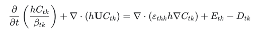
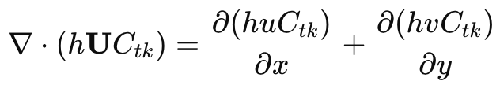
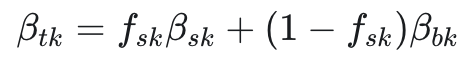
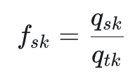
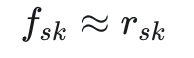
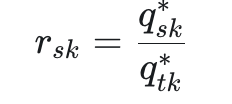
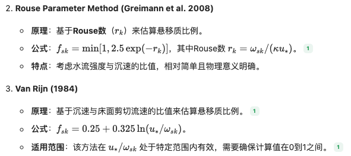
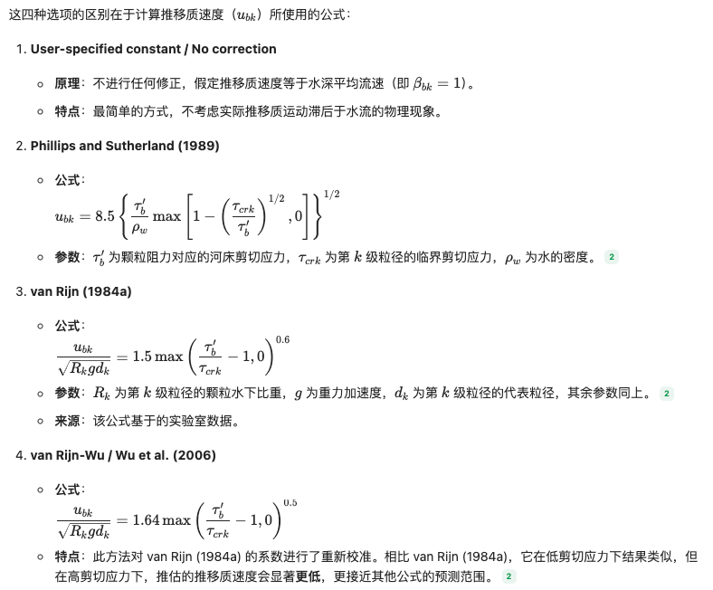
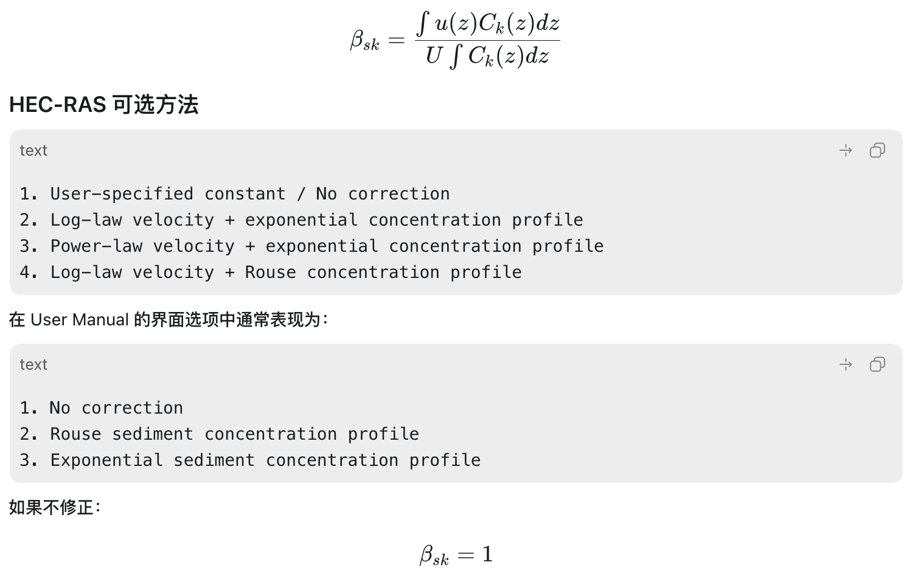

# 准稳态（Quasi-steady）

将一个随时间缓慢变化的长过程，切割成无数个连续的小时间段，在每个小时间段内将其视为恒定流来进行计算（介于恒定流和非恒定流）。

- 时间切片： 将完整的流量或水位过程线划分成若干个短时段。
- 分段恒定： 假设在每一个极短的时段内，水力条件（如流速、水深）保持不变，直接采用恒定流的公式来计算该时段内的水动力特性以及随之产生的泥沙冲淤结果。
- 动态衔接： 下一个时段的初始条件会承接上一个时段的计算结果（例如河床因为淤积抬高了一点），从而串联起整个长期的演变过程。

# 适用条件

- 长期河床演变模拟： 当你需要预测几个月、几年甚至几十年的河道淤积、河岸侵蚀或浅滩演变时，使用完全非恒定模型计算量过大，而准稳态可以快速得出长期的连续状态变化。
- 水文条件缓慢变化： 适用于大型河流系统，其水位和流量的涨落过程相对平缓，没有剧烈的瞬变（如溃坝、突发洪水等）。
- 工程规划与评估： 在环境影响评价、航道疏浚规划、水库泥沙堆积分析中，工程师往往更关注宏观的长期趋势而非秒级的瞬时波动，准稳态能提供足够的决策依据。
- 忽略流体惯性效应： 当水流状态的改变非常缓慢，流体的惯性和系统的弹性（如水锤效应）可以忽略不计时，准稳态是非常合理的简化。

# 水沙流程

第 1 步：解水动力方程
得到水深、流速、剪切力。

第 2 步：根据水流和床沙条件计算输沙能力
判断当前水流理论上能携带多少各粒径泥沙

第 3 步：计算落速、悬移比例、推移质/悬移质修正
把输沙能力拆分并转成深平均模型可用参数。

第 4 步：解总输沙输移方程
得到水体中的实际泥沙浓度和实际输沙量。

HEC-RAS 2D Sediment Technical Reference Manual
Total-load → Total-load Transport Equation
手册页码：38
公式编号：66

总共是

* h：水深（**来自水动力模块）**
* **U**：二维深平均流速向量 **U**=(u, v）（**来自水动力模块）;**

* Ctk：第 k 个粒径总输沙浓度（**求解量**）；初始值：初始含沙量、边界泥沙浓度
* Btk：总输沙修正系数（修正深平均模型无法显式表达的垂向非均匀性和推移质速度差异）

* fsk：第 k 粒径级的悬移质比例

  →→（首选：悬移质输沙能力/总输沙能力）

  * 
* Bsk：推移质修正系数（不修正取 1）

  * Bsk=ubk/U(第 k 粒径级推移质平均运动速度/水流深平均速度模长)
  * ubk：
* Bbk：悬移质修正系数
* 
* 

第 5 步：计算侵蚀和沉积
比较输沙能力、实际浓度、床面可供给材料，得到源汇项。

第 6 步：计算床面变化
把侵蚀沉积转换为床面冲刷或淤积。

第 7 步：更新床沙级配、活动层、床层、孔隙率和糙率
为下一个时间步提供新的床面条件。

| 步骤 | 主要任务         | 输入                                               | 用到的公式/模型类别                                                | 输出                                                 | 传给下一步                    |
| ---- | ---------------- | -------------------------------------------------- | ------------------------------------------------------------------ | ---------------------------------------------------- | ----------------------------- |
| 1    | 解水动力         | 地形、网格、糙率、边界流量/水位、初始水面          | DWE 或 SWE-ELM / SWE-EM                                            | 水深、流速、水面坡降、剪切力、剪切速度、干湿状态     | 输沙能力、落速/扩散、侵蚀沉积 |
| 2    | 算输沙能力       | 水深、流速、剪切力、床沙粒径、密度、级配           | Ackers-White、Engelund-Hansen、Laursen、MPM、Yang、van Rijn、Wu 等 | 各粒径级的平衡输沙能力                               | 悬移比例、侵蚀沉积            |
| 3    | 算落速和推悬分配 | 粒径、水温、黏度、剪切速度、输沙能力               | 落速公式、Rouse 参数、悬移比例公式、推移质/悬移质修正系数          | 落速、悬移比例、推移质比例、总输沙修正系数、扩散系数 | 总输沙方程                    |
| 4    | 解总输沙输移方程 | 流速、水深、扩散系数、修正系数、边界含沙量、源汇项 | 总输沙对流-扩散-源汇方程                                           | 实际泥沙浓度、实际输沙量                             | 侵蚀沉积、床面变化            |
| 5    | 算侵蚀和沉积     | 实际输沙量、输沙能力、剪切力、落速、床面材料       | 非黏性适应公式、黏性侵蚀公式、Krone/Partheniades 沉积公式          | 各粒径侵蚀率、沉积率                                 | 床面冲淤方程                  |
| 6    | 算床面变化       | 侵蚀率、沉积率、孔隙率、颗粒密度、床坡             | Exner 类床面变化方程、床坡修正项                                   | 床面高程变化、各粒径冲淤量                           | 床层/级配更新                 |
| 7    | 更新床面条件     | 冲淤量、沉积物级配、原床层级配                     | 活动层模型、多床层模型、掩蔽暴露、孔隙率/糙率公式                  | 新床面高程、新床沙级配、新孔隙率、新糙率             | 返回第 1 步                   |

# 问题

缺少初始化泥沙浓度

缺少初始化床沙级配

泥沙修正系数、扩散系数目前为 1，0.1
